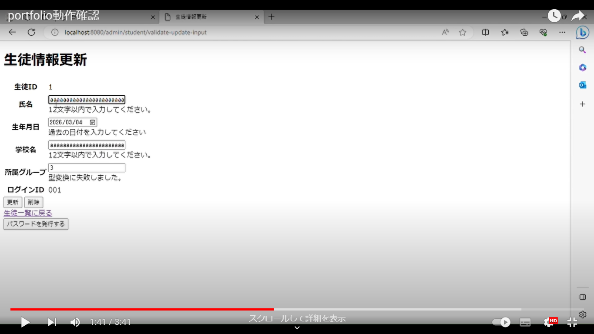

## portfolio (Webアプリのソースコード)

JavaとSpringの学習時に作成したアプリのソースコードを公開させていただきます。  

H2データベースの設定ができていない為、コーディングレベルの確認にご覧いただければ幸いです。

## Springを用いた実装機能

ログイン機能
ハッシュ値を用いてユーザー登録管理

データベース操作
検索系、更新系各種機能の実装

Viewの基本
入力→確認→完了の画面遷移

## アプリケーションについて

生徒の情報を管理するアプリです。  
  
ログイン後、生徒情報のCRUD処理を行うことができます。  
主にjdbcTempleteを使用。  
  
データベースより得た情報は一部加工して表示してあります。   
生年月日から現在の学年を計算等。

ヒューマンエラー防止の観点より入力→確認→完了の画面遷移とエラーチェックを実装してあります。
生徒情報からログイン用のIDとPasswordを生成し、登録できます。

## これから必要な実装

ログイン用のIDとPasswordも変更可能にして、権限については生徒と管理者で振り分けて実装していく必要があります。
コンストラクタについて様々な表記を試したかった為、アノテーションの有無等が統一されていません。

## 文責

* 作成者：安本侑真
* E-mail：tehepero0217@icloud.com
